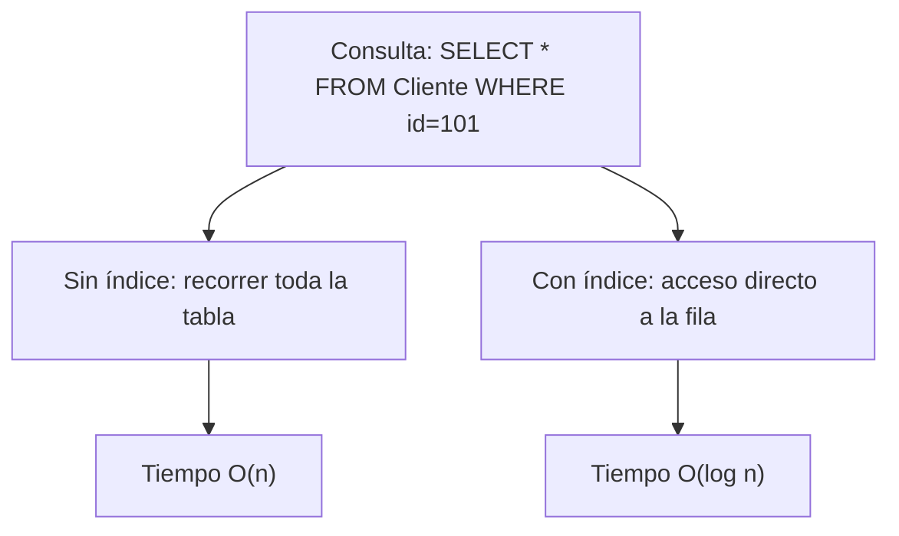
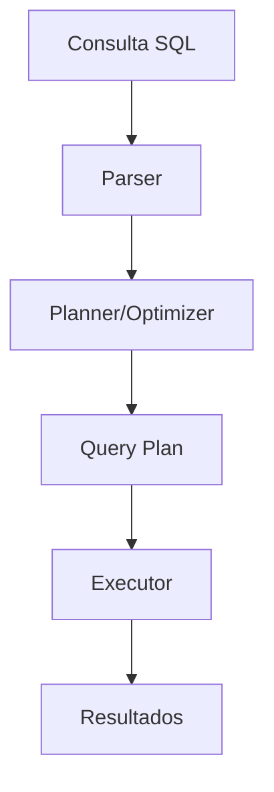

# 📊 Capítulo Final: Optimización y Seguridad en Bases de Datos

En este capítulo aprenderás a optimizar consultas para mejorar el rendimiento y a implementar seguridad mediante control de accesos y cifrado. Además, revisaremos cómo administrar usuarios y roles en un sistema organizacional.

---

## 1. Optimización de Consultas

### 🔹 ¿Qué es un índice?

Un **índice** es una estructura de datos auxiliar que acelera las búsquedas en una tabla, similar al índice de un libro.  
En lugar de recorrer toda la tabla (full scan), la base de datos utiliza el índice para acceder directamente a las filas relevantes.

**Tipos de índices más comunes en PostgreSQL:**
- **B-Tree (por defecto):** ideal para igualdad y rangos (`=`, `<`, `>`, `BETWEEN`).
- **Hash:** rápido en igualdad (`=`), aunque menos usado.
- **GIN / GiST:** útiles para búsquedas en texto, JSON, arrays.
- **BRIN:** optimizado para tablas muy grandes ordenadas (datos secuenciales).

---

### 🔹 Diagrama explicativo de índices



---

### 🔹 Ejemplo de índice

```sql
-- Crear índice sobre columna id_cliente
CREATE INDEX idx_cliente_id ON Cliente(id_cliente);

-- Consultar el plan de ejecución
EXPLAIN SELECT * FROM Cliente WHERE id_cliente = 101;
```

---

### 🔹 Query Plan en PostgreSQL

El **query planner** decide la estrategia óptima para ejecutar una consulta.  
Podemos usar `EXPLAIN` para analizarlo:

```sql
EXPLAIN ANALYZE
SELECT nombre
FROM Cliente
WHERE correo = 'ana@correo.com';
```

**Salida típica:**
- `Seq Scan` (secuencial): recorre toda la tabla.
- `Index Scan`: usa un índice para acelerar.
- `Bitmap Heap Scan`: combinación de índices y accesos agrupados.

---

### 🔹 Diagrama de un query plan simplificado



---

## 2. Seguridad en Bases de Datos

La seguridad se basa en **control de accesos**, **cifrado** y **respaldos**.  
Aquí veremos el control de usuarios y roles.

---

### 🔹 Sistema de usuarios y permisos

Supongamos una organización con tres perfiles:
1. **Administrador:** acceso completo.
2. **Analista:** puede consultar, pero no modificar.
3. **Operador:** puede insertar y actualizar, pero no borrar.

---

### 🔹 Implementación en PostgreSQL

```sql
-- Crear roles
CREATE ROLE admin;
CREATE ROLE analista;
CREATE ROLE operador;

-- Crear usuarios y asignar roles
CREATE USER juan WITH PASSWORD 'admin123';
GRANT admin TO juan;

CREATE USER maria WITH PASSWORD 'analista123';
GRANT analista TO maria;

CREATE USER pedro WITH PASSWORD 'operador123';
GRANT operador TO pedro;
```

---

### 🔹 Asignación de permisos

```sql
-- Conceder permisos a cada rol
-- Administrador: todos los privilegios
GRANT ALL PRIVILEGES ON DATABASE empresa TO admin;

-- Analista: solo lectura
GRANT CONNECT ON DATABASE empresa TO analista;
GRANT USAGE ON SCHEMA public TO analista;
GRANT SELECT ON ALL TABLES IN SCHEMA public TO analista;

-- Operador: puede insertar y actualizar
GRANT CONNECT ON DATABASE empresa TO operador;
GRANT USAGE ON SCHEMA public TO operador;
GRANT INSERT, UPDATE ON ALL TABLES IN SCHEMA public TO operador;
```

---

### 🔹 Ejemplo práctico

Supongamos la tabla:

```sql
CREATE TABLE ventas (
  id SERIAL PRIMARY KEY,
  producto VARCHAR(100),
  cantidad INT,
  precio DECIMAL(10,2)
);
```

- **Analista (`maria`)** puede ejecutar:

```sql
SELECT * FROM ventas;
```

- **Operador (`pedro`)** puede ejecutar:

```sql
INSERT INTO ventas (producto, cantidad, precio)
VALUES ('Laptop', 2, 1500.00);
```

Pero si intenta:

```sql
DELETE FROM ventas WHERE id=1;
```

👉 Obtendrá un error de permisos.

---

## 3. Respaldo y Réplicas

Además del control de accesos, la seguridad incluye estrategias de continuidad:

- **Respaldos completos:** copia entera de la base.
- **Respaldos incrementales:** solo los cambios desde el último respaldo.
- **Replicas de lectura:** copias en servidores secundarios, útiles para balancear carga de consultas.

---

## 4. Buenas prácticas de seguridad

✅ Usa contraseñas fuertes y cambia periódicamente.  
✅ Crea roles según funciones, no usuarios con permisos directos.  
✅ Limita accesos con `GRANT` solo a lo necesario (principio de privilegio mínimo).  
✅ Revisa los `query plans` con `EXPLAIN` antes de optimizar.  
✅ Mantén índices actualizados y elimina los que no se usen.  
✅ Implementa respaldos y pruebas de recuperación periódicas.  

---

## 5. Conclusión

- Los **índices** aceleran consultas, pero deben usarse con criterio.  
- El **query planner** es una herramienta fundamental para diagnosticar rendimiento.  
- La **seguridad** en bases de datos se logra con roles, permisos, respaldos y réplicas.  
- Una buena política de permisos garantiza integridad y confidencialidad en la organización.  

---
