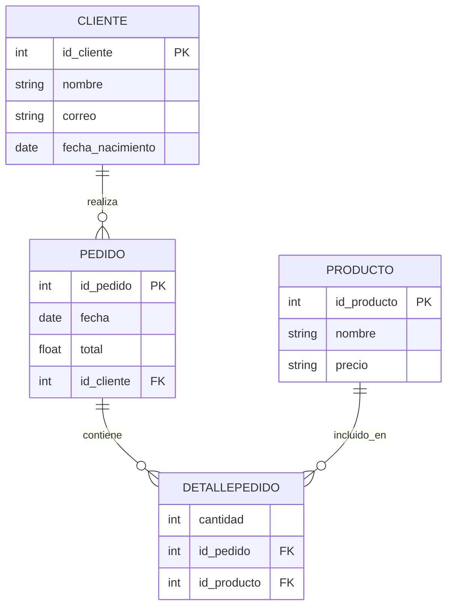
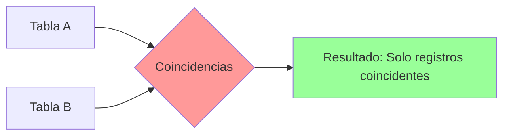
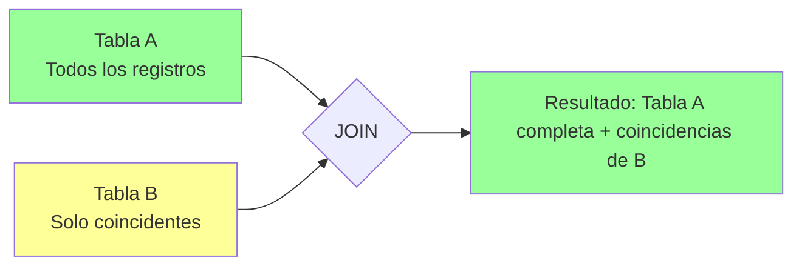
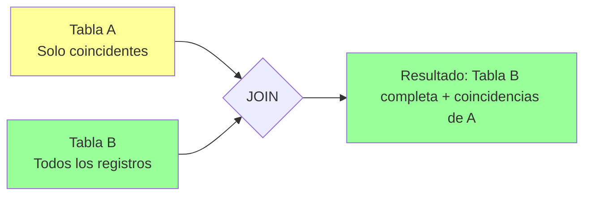
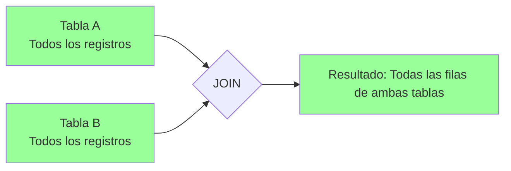
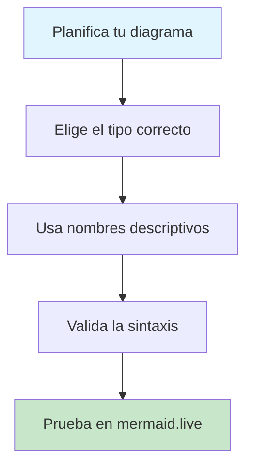

# Guía Práctica de Comandos SQL - Sistema de E-commerce

## Introducción

Esta guía cubre los comandos fundamentales de SQL en PostgreSQL utilizando ejemplos prácticos de un **sistema de e-commerce**. Incluye ejemplos claros, buenas prácticas y diagramas visuales utilizando Mermaid para facilitar el aprendizaje.

## Esquema del Sistema de E-commerce

Para los ejemplos utilizaremos las siguientes tablas de un sistema de tienda en línea:



***

## Comandos Básicos

### SELECT

Consulta datos de una tabla.

```sql
SELECT columna1, columna2 FROM tabla WHERE condición;
```

**Ejemplos del Sistema de E-commerce:**

```sql
-- Consultar clientes nacidos después del año 2000
SELECT nombre, correo FROM Cliente WHERE fecha_nacimiento >= '2000-01-01';

-- Consultar productos con precio mayor a $50
SELECT nombre, precio 
FROM Producto 
WHERE CAST(precio AS DECIMAL) > 50.00;

-- Consultar los últimos 10 pedidos realizados
SELECT id_pedido, fecha, total, id_cliente
FROM Pedido 
ORDER BY fecha DESC 
LIMIT 10;

-- Obtener productos ordenados por precio
SELECT id_producto, nombre, precio
FROM Producto
ORDER BY CAST(precio AS DECIMAL) ASC;
```

> Es recomendable especificar solo las columnas necesarias y evitar `SELECT *` por cuestiones de rendimiento y claridad.[^1]

***

### INSERT

Inserta registros en una tabla.

```sql
INSERT INTO tabla (columna1, columna2) VALUES (valor1, valor2);
```

**Ejemplos del Sistema de E-commerce:**

```sql
-- Registrar un nuevo cliente
INSERT INTO Cliente (id_cliente, nombre, correo, fecha_nacimiento) 
VALUES (1, 'Ana García', 'ana.garcia@email.com', '1995-03-15');

-- Agregar un nuevo producto
INSERT INTO Producto (id_producto, nombre, precio) 
VALUES (101, 'Laptop HP', '899.99');

-- Crear un nuevo pedido
INSERT INTO Pedido (id_pedido, fecha, total, id_cliente) 
VALUES (1001, '2024-09-05', 1299.98, 1);

-- Agregar detalles al pedido
INSERT INTO DetallePedido (cantidad, id_pedido, id_producto) 
VALUES (1, 1001, 101);

-- Insertar múltiples productos a la vez
INSERT INTO Producto (id_producto, nombre, precio) VALUES
(102, 'Mouse Inalámbrico', '25.99'),
(103, 'Teclado Mecánico', '89.99'),
(104, 'Monitor 24"', '299.99');
```

> Es buena práctica indicar siempre los campos en que se insertan los datos y usar transacciones para operaciones múltiples.[^2]

***

### UPDATE

Modifica registros existentes.

```sql
UPDATE tabla SET columna1 = valor1 WHERE condición;
```

**Ejemplos del Sistema de E-commerce:**

```sql
-- Actualizar el precio de un producto
UPDATE Producto 
SET precio = '79.99' 
WHERE id_producto = 102;

-- Cambiar el correo electrónico de un cliente
UPDATE Cliente 
SET correo = 'ana.garcia.nuevo@email.com' 
WHERE id_cliente = 1;

-- Actualizar el total de un pedido
UPDATE Pedido 
SET total = 1599.97 
WHERE id_pedido = 1001;

-- Modificar la cantidad en un detalle de pedido
UPDATE DetallePedido 
SET cantidad = 2 
WHERE id_pedido = 1001 AND id_producto = 101;

-- Actualizar precios con descuento del 10%
UPDATE Producto 
SET precio = CAST(CAST(precio AS DECIMAL) * 0.9 AS VARCHAR)
WHERE CAST(precio AS DECIMAL) > 100;
```

> Siempre utiliza `WHERE` para evitar modificar todos los registros inadvertidamente y considera usar transacciones para operaciones críticas.[^1]

***

### DELETE

Elimina registros de una tabla.

```sql
DELETE FROM tabla WHERE condición;
```

**Ejemplos del Sistema de E-commerce:**

```sql
-- Eliminar productos descontinuados (precio = 0)
DELETE FROM Producto 
WHERE CAST(precio AS DECIMAL) = 0;

-- Eliminar detalles de pedidos cancelados
DELETE FROM DetallePedido 
WHERE id_pedido IN (
    SELECT id_pedido FROM Pedido WHERE total = 0
);

-- Eliminar pedidos antiguos sin detalles
DELETE FROM Pedido 
WHERE fecha < '2020-01-01' 
AND id_pedido NOT IN (
    SELECT DISTINCT id_pedido FROM DetallePedido
);

-- Eliminar cliente específico (cuidado con las referencias)
DELETE FROM Cliente 
WHERE id_cliente = 999 
AND id_cliente NOT IN (
    SELECT DISTINCT id_cliente FROM Pedido
);
```

> Verifica la condición del WHERE antes de ejecutar el comando y considera hacer un respaldo antes de eliminaciones masivas.[^2]

***

### CREATE TABLE

Crea una nueva tabla.

**Ejemplos del Sistema de E-commerce:**

```sql
-- Crear tabla de clientes
CREATE TABLE Cliente (
    id_cliente INT NOT NULL,
    nombre VARCHAR(200) NOT NULL,
    correo VARCHAR(200) NOT NULL,
    fecha_nacimiento DATE NOT NULL,
    PRIMARY KEY (id_cliente),
    UNIQUE (id_cliente)
);

-- Crear tabla de productos
CREATE TABLE Producto (
    id_producto INT NOT NULL,
    nombre VARCHAR(50) NOT NULL,
    precio VARCHAR(100) NOT NULL,
    PRIMARY KEY (id_producto)
);

-- Crear tabla de pedidos
CREATE TABLE Pedido (
    id_pedido INT NOT NULL,
    fecha DATE NOT NULL,
    total FLOAT NOT NULL,
    id_cliente INT NOT NULL,
    PRIMARY KEY (id_pedido),
    FOREIGN KEY (id_cliente) REFERENCES Cliente(id_cliente)
);

-- Crear tabla de detalles de pedido
CREATE TABLE DetallePedido (
    cantidad INT NOT NULL,
    id_pedido INT NOT NULL,
    id_producto INT NOT NULL,
    FOREIGN KEY (id_pedido) REFERENCES Pedido(id_pedido),
    FOREIGN KEY (id_producto) REFERENCES Producto(id_producto)
);

-- Crear índices para mejorar el rendimiento
CREATE INDEX idx_cliente_correo ON Cliente(correo);
CREATE INDEX idx_pedido_fecha ON Pedido(fecha);
CREATE INDEX idx_detalle_pedido ON DetallePedido(id_pedido);
```

> Usa tipos de datos adecuados, define siempre la clave primaria (PRIMARY KEY), y utiliza restricciones (CHECK, FOREIGN KEY) para mantener la integridad de los datos.[^2]

***

### ALTER TABLE

Modifica la estructura de una tabla.

**Ejemplos del Sistema de E-commerce:**

```sql
-- Agregar nueva columna de descripción a Producto
ALTER TABLE Producto ADD COLUMN descripcion TEXT;

-- Agregar columna de teléfono a Cliente
ALTER TABLE Cliente ADD COLUMN telefono VARCHAR(20);

-- Modificar el tipo de dato del precio (de VARCHAR a DECIMAL)
ALTER TABLE Producto ALTER COLUMN precio TYPE DECIMAL(10,2) USING CAST(precio AS DECIMAL);

-- Agregar restricción de verificación para cantidad
ALTER TABLE DetallePedido 
ADD CONSTRAINT chk_cantidad_positiva 
CHECK (cantidad > 0);

-- Agregar columna de estado al pedido
ALTER TABLE Pedido ADD COLUMN estado VARCHAR(20) DEFAULT 'PENDIENTE';

-- Crear tabla de categorías para productos
CREATE TABLE Categoria (
    id_categoria INT PRIMARY KEY,
    nombre VARCHAR(100) NOT NULL,
    descripcion TEXT
);

-- Agregar referencia a categoría en productos
ALTER TABLE Producto ADD COLUMN id_categoria INT;
ALTER TABLE Producto ADD FOREIGN KEY (id_categoria) REFERENCES Categoria(id_categoria);
```

> Haz respaldos antes de realizar cambios estructurales en tablas en producción y considera el impacto en las aplicaciones existentes.[^2]

***

### DROP TABLE

Elimina una tabla de la base de datos.

**Ejemplos del Sistema de E-commerce:**

```sql
-- Eliminar tabla temporal de migración
DROP TABLE IF EXISTS temp_productos_migracion;

-- Eliminar tabla de promociones expiradas
DROP TABLE promociones_2023;

-- Eliminar vista que ya no se necesita
DROP VIEW IF EXISTS vista_resumen_ventas;

-- Eliminar tabla con cuidado (verificar dependencias primero)
-- Primero eliminar las tablas dependientes
DROP TABLE IF EXISTS DetallePedido;
DROP TABLE IF EXISTS Pedido;
-- Luego las tablas principales
DROP TABLE IF EXISTS Producto;
DROP TABLE IF EXISTS Cliente;
```

> Úsalo con precaución, ya que los datos se pierden permanentemente. Siempre haz respaldo antes de eliminar tablas importantes.[^2]

***

## Joins en SQL: Teoría y Ejemplos Prácticos

Los JOIN permiten combinar registros de dos o más tablas relacionadas. Usando nuestro sistema de e-commerce, veremos ejemplos prácticos de cada tipo.

### INNER JOIN

Devuelve solo los registros que tienen coincidencias en ambas tablas.

```sql
SELECT a.*, b.*
FROM tablaA a
INNER JOIN tablaB b ON a.id = b.id_a;
```

**Ejemplos del Sistema de E-commerce:**

```sql
-- Obtener clientes con sus pedidos
SELECT c.nombre, c.correo, p.id_pedido, p.fecha, p.total
FROM Cliente c
INNER JOIN Pedido p ON c.id_cliente = p.id_cliente;

-- Productos vendidos con detalles de pedido
SELECT 
    pr.nombre AS producto,
    pr.precio,
    dp.cantidad,
    p.fecha,
    c.nombre AS cliente
FROM Producto pr
INNER JOIN DetallePedido dp ON pr.id_producto = dp.id_producto
INNER JOIN Pedido p ON dp.id_pedido = p.id_pedido
INNER JOIN Cliente c ON p.id_cliente = c.id_cliente;

-- Pedidos con todos sus productos
SELECT 
    p.id_pedido,
    p.fecha,
    pr.nombre AS producto,
    dp.cantidad,
    CAST(pr.precio AS DECIMAL) * dp.cantidad AS subtotal
FROM Pedido p
INNER JOIN DetallePedido dp ON p.id_pedido = dp.id_pedido
INNER JOIN Producto pr ON dp.id_producto = pr.id_producto
ORDER BY p.id_pedido, pr.nombre;
```

#### Diagrama Mermaid para INNER JOIN



> El INNER JOIN devuelve únicamente las filas que tienen coincidencias en ambas tablas.[^4][^5]

***

### LEFT JOIN

Devuelve todos los registros de la tabla izquierda y los que coinciden de la derecha; si no hay coincidencia, el resultado de la derecha es NULL.

```sql
SELECT a.*, b.*
FROM tablaA a
LEFT JOIN tablaB b ON a.id = b.id_a;
```

**Ejemplos del Sistema de E-commerce:**

```sql
-- Todos los clientes y sus pedidos (incluso clientes sin pedidos)
SELECT c.nombre, c.correo, p.id_pedido, p.fecha, p.total
FROM Cliente c
LEFT JOIN Pedido p ON c.id_cliente = p.id_cliente;

-- Todos los productos y sus ventas (incluso productos no vendidos)
SELECT 
    pr.nombre AS producto,
    pr.precio,
    COUNT(dp.id_producto) AS veces_vendido,
    COALESCE(SUM(dp.cantidad), 0) AS cantidad_total_vendida
FROM Producto pr
LEFT JOIN DetallePedido dp ON pr.id_producto = dp.id_producto
GROUP BY pr.id_producto, pr.nombre, pr.precio
ORDER BY cantidad_total_vendida DESC;

-- Clientes y el total de sus compras (incluso clientes sin compras)
SELECT 
    c.nombre,
    c.correo,
    COUNT(p.id_pedido) AS total_pedidos,
    COALESCE(SUM(p.total), 0) AS total_gastado
FROM Cliente c
LEFT JOIN Pedido p ON c.id_cliente = p.id_cliente
GROUP BY c.id_cliente, c.nombre, c.correo
ORDER BY total_gastado DESC;
```

#### Diagrama Mermaid para LEFT JOIN



***

### RIGHT JOIN

Devuelve todos los registros de la tabla derecha y los que coinciden de la izquierda; si no hay coincidencia, el resultado de la izquierda es NULL.

```sql
SELECT a.*, b.*
FROM tablaA a
RIGHT JOIN tablaB b ON a.id = b.id_a;
```

**Ejemplos del Sistema de E-commerce:**

```sql
-- Todos los pedidos y información de cliente (incluso pedidos sin cliente válido)
SELECT c.nombre, c.correo, p.id_pedido, p.fecha, p.total
FROM Cliente c
RIGHT JOIN Pedido p ON c.id_cliente = p.id_cliente;

-- Todos los detalles de pedido con información de producto
SELECT 
    dp.id_pedido,
    dp.cantidad,
    COALESCE(pr.nombre, 'Producto no encontrado') AS producto,
    COALESCE(pr.precio, '0') AS precio
FROM Producto pr
RIGHT JOIN DetallePedido dp ON pr.id_producto = dp.id_producto
ORDER BY dp.id_pedido;
```

#### Diagrama Mermaid para RIGHT JOIN



***

### FULL OUTER JOIN

Devuelve registros cuando hay una coincidencia en una de las tablas.

```sql
SELECT a.*, b.*
FROM tablaA a
FULL OUTER JOIN tablaB b ON a.id = b.id_a;
```

**Ejemplos del Sistema de E-commerce:**

```sql
-- Clientes y pedidos (todos los clientes y todos los pedidos)
SELECT 
    COALESCE(c.nombre, 'Cliente eliminado') AS cliente,
    COALESCE(p.id_pedido::VARCHAR, 'Sin pedido') AS pedido,
    p.total,
    p.fecha
FROM Cliente c
FULL OUTER JOIN Pedido p ON c.id_cliente = p.id_cliente;

-- Auditoría completa: todos los productos y todas las ventas
SELECT 
    pr.nombre AS producto,
    dp.cantidad,
    dp.id_pedido,
    p.fecha
FROM Producto pr
FULL OUTER JOIN DetallePedido dp ON pr.id_producto = dp.id_producto
FULL OUTER JOIN Pedido p ON dp.id_pedido = p.id_pedido
WHERE pr.id_producto IS NOT NULL OR dp.id_pedido IS NOT NULL;
```

#### Diagrama Mermaid para FULL OUTER JOIN



### JOIN Avanzados para el Sistema de E-commerce

```sql
-- Reporte completo de actividad de clientes
SELECT 
    c.id_cliente,
    c.nombre,
    c.correo,
    COUNT(DISTINCT p.id_pedido) AS total_pedidos,
    COUNT(dp.id_producto) AS total_productos_comprados,
    COALESCE(SUM(p.total), 0) AS total_gastado,
    COALESCE(AVG(p.total), 0) AS promedio_por_pedido,
    MAX(p.fecha) AS ultima_compra
FROM Cliente c
LEFT JOIN Pedido p ON c.id_cliente = p.id_cliente
LEFT JOIN DetallePedido dp ON p.id_pedido = dp.id_pedido
GROUP BY c.id_cliente, c.nombre, c.correo
ORDER BY total_gastado DESC;

-- Análisis de ventas por producto
SELECT 
    pr.id_producto,
    pr.nombre,
    CAST(pr.precio AS DECIMAL) AS precio_unitario,
    COUNT(dp.id_pedido) AS veces_vendido,
    SUM(dp.cantidad) AS cantidad_total_vendida,
    SUM(dp.cantidad * CAST(pr.precio AS DECIMAL)) AS ingresos_totales,
    AVG(dp.cantidad) AS cantidad_promedio_por_pedido
FROM Producto pr
LEFT JOIN DetallePedido dp ON pr.id_producto = dp.id_producto
LEFT JOIN Pedido p ON dp.id_pedido = p.id_pedido
WHERE p.fecha IS NULL OR p.fecha >= '2024-01-01'
GROUP BY pr.id_producto, pr.nombre, pr.precio
ORDER BY ingresos_totales DESC;
```

***

## Buenas Prácticas para Sistemas de E-commerce

- **Usa transacciones** para operaciones críticas como procesar pedidos para mantener la consistencia entre tablas.[^1]
- **Implementa auditoría** para todas las operaciones de ventas y cambios de inventario.
- **Normaliza** tus tablas pero considera la desnormalización para consultas de reportes frecuentes.[^3]
- Utiliza **índices** en columnas como `id_cliente`, `fecha`, `id_producto` para mejorar el rendimiento de consultas.
- **Valida** la integridad de datos: precios positivos, cantidades válidas, referencias válidas entre tablas.[^7]
- Usa `VACUUM` y `ANALYZE` regularmente para el mantenimiento óptimo de la base de datos.[^6]
- Implementa **respaldos automáticos** especialmente antes de operaciones de actualización masiva.
- Define **restricciones de integridad** para evitar estados inconsistentes (ej: cantidades negativas, precios inválidos).
- Usa **sentencias preparadas** para prevenir inyección SQL en formularios web.[^1]
- Limita privilegios: cada módulo de la aplicación debe tener solo los permisos mínimos necesarios.[^7]
- **Optimiza consultas** con JOINs complejos usando EXPLAIN ANALYZE para identificar cuellos de botella.

***

## Ejercicios Propuestos - Sistema de E-commerce

### Nivel Básico

1. **Crear las tablas del sistema:**
   - Crear las tablas Cliente, Producto, Pedido y DetallePedido según el esquema proporcionado
   - Agregar las restricciones de integridad y claves foráneas
   - Crear índices básicos para mejorar el rendimiento

2. **Operaciones básicas:**
   - Insertar 5 clientes de prueba con diferentes fechas de nacimiento
   - Agregar 10 productos con precios variados
   - Crear 8 pedidos distribuidos entre los clientes

3. **Consultas básicas:**
   - Consultar todos los clientes nacidos después del año 1990
   - Mostrar todos los productos con precio mayor a $50
   - Listar los pedidos del último mes ordenados por fecha

### Nivel Intermedio

4. **Consultas con JOIN:**
   - Obtener un reporte de clientes con la cantidad total de pedidos realizados
   - Mostrar todos los productos vendidos con el nombre del cliente que los compró
   - Generar un reporte de pedidos con el detalle completo de productos

5. **Agregaciones:**
   - Calcular el precio promedio de los productos
   - Obtener el total de ventas por mes del año actual
   - Encontrar los 5 productos más vendidos (por cantidad)

### Nivel Avanzado

6. **Consultas complejas:**
   - Crear una vista que muestre el historial completo de compras por cliente
   - Implementar una consulta que identifique clientes que no han comprado en los últimos 6 meses
   - Generar un reporte de productos que nunca se han vendido

7. **Optimización:**
   - Crear índices apropiados para mejorar las consultas más frecuentes
   - Analizar el rendimiento de consultas con EXPLAIN ANALYZE
   - Optimizar la consulta de reporte de ventas mensual

### Ejercicio Integrador

8. **Sistema de gestión de pedidos:**

   ```sql
   -- Implementar una función que procese un pedido completo
   CREATE OR REPLACE FUNCTION procesar_pedido(
       p_id_cliente INTEGER,
       p_productos INTEGER[],
       p_cantidades INTEGER[]
   ) RETURNS INTEGER AS $$
   DECLARE
       nuevo_pedido_id INTEGER;
       total_pedido FLOAT := 0;
       i INTEGER;
   BEGIN
       -- Tu código aquí
       -- Crear pedido, calcular total, insertar detalles
       -- Validar existencia de productos y cliente
       -- Usar transacciones para mantener consistencia
       RETURN nuevo_pedido_id;
   END;
   $$ LANGUAGE plpgsql;
   ```

***

## Comandos Avanzados para el Sistema de Pagos

### Vistas (Views)

```sql
-- Vista para resumen de cuentas por usuario
CREATE VIEW resumen_usuario AS
SELECT 
    u.id,
    u.nombre,
    u.email,
    COUNT(c.id) AS total_cuentas,
    SUM(c.saldo) AS saldo_total,
    AVG(c.saldo) AS saldo_promedio
FROM usuarios u
LEFT JOIN cuentas c ON u.id = c.usuario_id AND c.activa = true
GROUP BY u.id, u.nombre, u.email;

-- Vista para transacciones del día
CREATE VIEW transacciones_hoy AS
SELECT 
    t.*,
    uo.nombre AS usuario_origen,
    ud.nombre AS usuario_destino
FROM transacciones t
JOIN cuentas co ON t.cuenta_origen_id = co.id
JOIN cuentas cd ON t.cuenta_destino_id = cd.id
JOIN usuarios uo ON co.usuario_id = uo.id
JOIN usuarios ud ON cd.usuario_id = ud.id
WHERE DATE(t.fecha_transaccion) = CURRENT_DATE;
```

### Funciones y Triggers

```sql
-- Función para actualizar saldos automáticamente
CREATE OR REPLACE FUNCTION actualizar_saldos()
RETURNS TRIGGER AS $$
BEGIN
    IF NEW.estado = 'COMPLETADA' AND OLD.estado != 'COMPLETADA' THEN
        -- Descontar del origen
        UPDATE cuentas 
        SET saldo = saldo - NEW.monto 
        WHERE id = NEW.cuenta_origen_id;
        
        -- Agregar al destino
        UPDATE cuentas 
        SET saldo = saldo + NEW.monto 
        WHERE id = NEW.cuenta_destino_id;
    END IF;
    
    RETURN NEW;
END;
$$ LANGUAGE plpgsql;

-- Trigger para ejecutar la función
CREATE TRIGGER trigger_actualizar_saldos
    AFTER UPDATE ON transacciones
    FOR EACH ROW
    EXECUTE FUNCTION actualizar_saldos();
```

***

## Recursos para Diagramación y Herramientas

### Herramientas de Diagramación

- **Mermaid Live Editor**: [mermaid.live](https://mermaid.live) - Editor en línea para crear y probar diagramas
- **VS Code Extensions**: 
  - Mermaid Preview
  - Database Client JTDS
  - PostgreSQL Formatter
- **Herramientas de Base de Datos**:
  - pgAdmin4 para administración de PostgreSQL
  - DBeaver como cliente universal de base de datos
  - DataGrip para desarrollo profesional

### Recursos de Aprendizaje

- **Documentación Oficial**: [postgresql.org/docs](https://postgresql.org/docs)
- **Práctica Online**: [sqlbolt.com](https://sqlbolt.com), [w3schools.com/sql](https://w3schools.com/sql)
- **Ejercicios Avanzados**: [hackerrank.com/domains/sql](https://hackerrank.com/domains/sql)

### Tips para Diagramas Mermaid



> Los diagramas Mermaid se pueden visualizar en editores compatibles como VS Code, GitHub, y editores en línea especializados.

***

## Datos de Ejemplo para Pruebas

Para facilitar las pruebas, aquí tienes un script con datos de ejemplo:

```sql
-- Insertar datos de ejemplo para el sistema de e-commerce

-- Clientes
INSERT INTO Cliente (id_cliente, nombre, correo, fecha_nacimiento) VALUES
(1, 'Ana García', 'ana.garcia@email.com', '1992-03-15'),
(2, 'Carlos López', 'carlos.lopez@email.com', '1988-07-22'),
(3, 'María Rodríguez', 'maria.rodriguez@email.com', '1995-11-08'),
(4, 'Juan Pérez', 'juan.perez@email.com', '1990-05-14'),
(5, 'Laura Martínez', 'laura.martinez@email.com', '1993-09-30');

-- Productos
INSERT INTO Producto (id_producto, nombre, precio) VALUES
(101, 'Laptop HP Pavilion', '899.99'),
(102, 'Mouse Inalámbrico Logitech', '25.99'),
(103, 'Teclado Mecánico', '89.99'),
(104, 'Monitor 24" Samsung', '299.99'),
(105, 'Webcam HD', '45.99'),
(106, 'Audífonos Bluetooth', '79.99'),
(107, 'Disco Duro Externo 1TB', '65.99'),
(108, 'Memoria USB 32GB', '12.99'),
(109, 'Cable HDMI', '15.99'),
(110, 'Mousepad Gaming', '19.99');

-- Pedidos
INSERT INTO Pedido (id_pedido, fecha, total, id_cliente) VALUES
(1001, '2024-08-15', 925.98, 1),
(1002, '2024-08-18', 389.98, 2),
(1003, '2024-08-20', 45.99, 3),
(1004, '2024-08-25', 171.97, 4),
(1005, '2024-09-01', 65.99, 5),
(1006, '2024-09-03', 95.98, 1),
(1007, '2024-09-05', 15.99, 2);

-- Detalles de Pedidos
INSERT INTO DetallePedido (cantidad, id_pedido, id_producto) VALUES
-- Pedido 1001 (Ana García)
(1, 1001, 101),  -- Laptop HP Pavilion
(1, 1001, 102),  -- Mouse Inalámbrico

-- Pedido 1002 (Carlos López)
(1, 1002, 104),  -- Monitor 24"
(1, 1002, 103),  -- Teclado Mecánico

-- Pedido 1003 (María Rodríguez)
(1, 1003, 105),  -- Webcam HD

-- Pedido 1004 (Juan Pérez)
(1, 1004, 106),  -- Audífonos Bluetooth
(1, 1004, 107),  -- Disco Duro Externo
(2, 1004, 108),  -- Memoria USB (2 unidades)

-- Pedido 1005 (Laura Martínez)
(1, 1005, 107),  -- Disco Duro Externo

-- Pedido 1006 (Ana García - segunda compra)
(1, 1006, 106),  -- Audífonos Bluetooth
(1, 1006, 110),  -- Mousepad Gaming

-- Pedido 1007 (Carlos López - segunda compra)
(1, 1007, 109);  -- Cable HDMI

-- Consultas de validación
SELECT 'Total de clientes:' as descripcion, COUNT(*) as cantidad FROM Cliente
UNION ALL
SELECT 'Total de productos:', COUNT(*) FROM Producto
UNION ALL
SELECT 'Total de pedidos:', COUNT(*) FROM Pedido
UNION ALL
SELECT 'Total de detalles:', COUNT(*) FROM DetallePedido;
```

***

Esta guía proporciona una base sólida para trabajar con PostgreSQL en el contexto de un sistema de e-commerce, combinando teoría, práctica y buenas prácticas de la industria. Los ejemplos son escalables y pueden adaptarse a sistemas más complejos según las necesidades del proyecto.

***

**Referencias:**

[^1]: https://learnsql.es/blog/los-comandos-mas-comunes-de-postgresql-una-guia-para-principiantes/

[^2]: https://es.slideshare.net/slideshow/comandos-y-funciones-sql-postgres/36657726

[^3]: https://www.reddit.com/r/PostgreSQL/comments/1h0zt4u/postgresql_best_practices_guidelines/

[^4]: https://translate.google.com/translate?u=https%3A%2F%2Fwww.cybertec-postgresql.com%2Fen%2Fer-diagrams-with-sql-and-mermaid%2F\&hl=es\&sl=en\&tl=es\&client=srp

[^5]: http://mermaid.js.org/syntax/entityRelationshipDiagram.html

[^6]: https://www.enterprisedb.com/blog/vacuum-y-analyze-en-postgresql-consejos-basados-en-las-mejores-practicas

[^7]: https://www.datasunrise.com/es/centro-de-conocimiento/seguridad-en-postgresql/

[^8]: https://www.librebyte.net/base-de-datos/comandos-para-administrar-postgres/

[^9]: https://cloud.google.com/spanner/docs/psql-commands?hl=es-419

[^10]: https://www.todopostgresql.com/meta-commands-de-psql-mas-utilizados-en-postgresql/

[^11]: https://docs.aws.amazon.com/es_es/prescriptive-guidance/latest/postgresql-query-tuning/postgresql-query-tuning.pdf

[^12]: https://www.todopostgresql.com/comandos-de-transacciones-en-postgresql/

[^13]: https://dev.to/infrony/creando-diagramas-con-chatgpt-y-mermaid-js-4h6m

[^14]: https://kinsta.com/es/blog/postgres-listar-bases-de-datos/

[^15]: https://learnsql.es/blog/19-ejercicios-practicos-de-postgresql-con-soluciones-detalladas/

[^16]: https://www.um.es/geograf/sigmur/sigpdf/postgresql.pdf

[^17]: https://translate.google.com/translate?u=https%3A%2F%2Fdocs.mermaidchart.com%2Fmermaid-oss%2Fsyntax%2FentityRelationshipDiagram.html\&hl=es\&sl=en\&tl=es\&client=srp

[^18]: https://translate.google.com/translate?u=https%3A%2F%2Fmermaid.js.org%2Fintro%2Fsyntax-reference.html\&hl=es\&sl=en\&tl=es\&client=srp

[^19]: https://translate.google.com/translate?u=https%3A%2F%2Fstackoverflow.com%2Fquestions%2F65212332%2Fhow-to-render-a-mermaid-flowchart-dynamically\&hl=es\&sl=en\&tl=es\&client=srp

[^20]: https://es.linkedin.com/advice/0/what-best-practices-optimizing-postgresql-database-t90vc?lang=es\&lang=es

